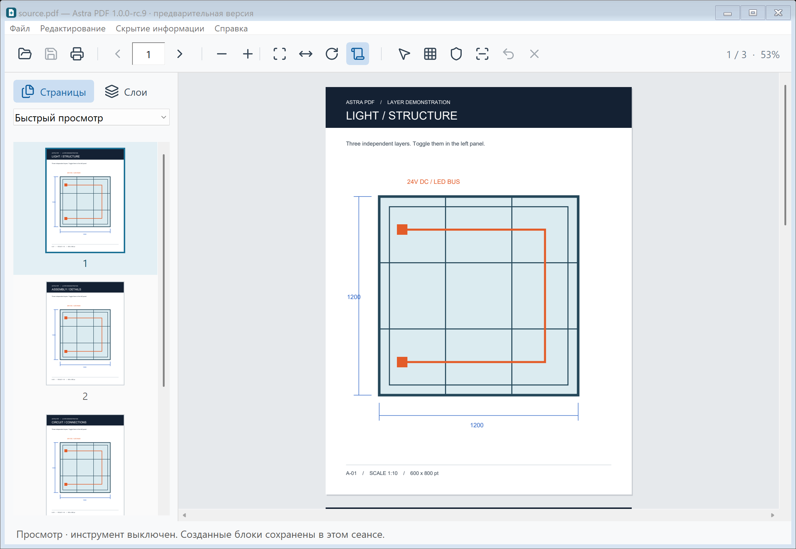
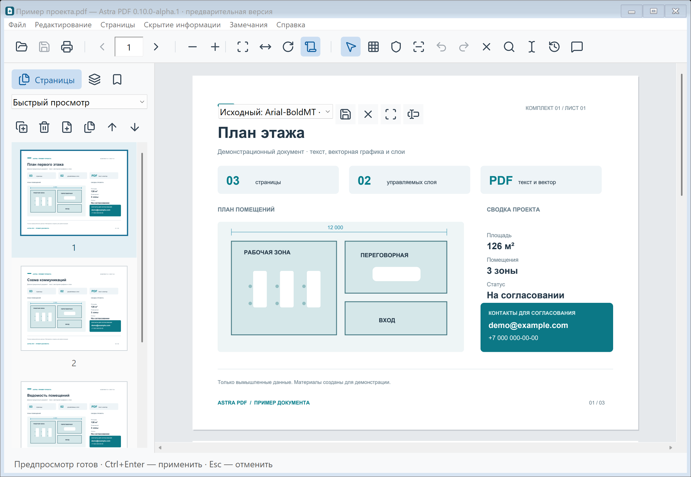
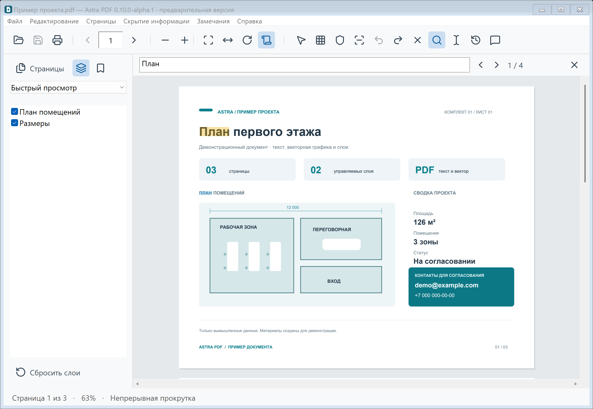
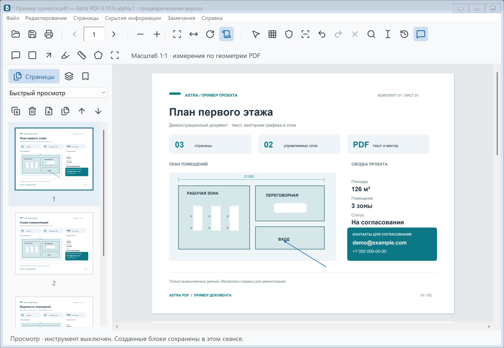
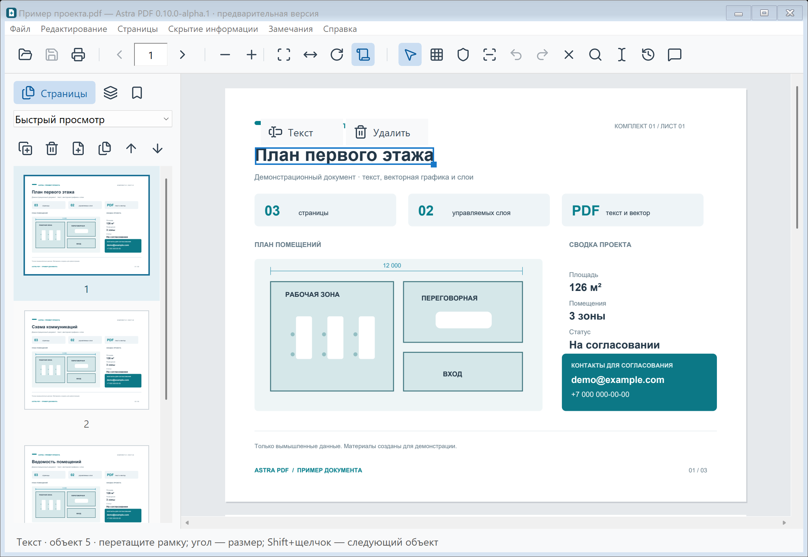
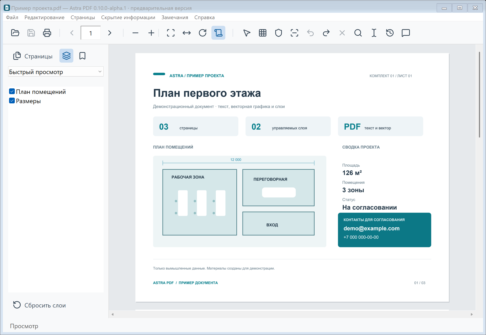

<p align="center">
  
</p>

<h1 align="center">Astra PDF</h1>

<p align="center">Просмотр и редактирование PDF для Windows 11 · Rust · PDFium</p>

<p align="center">
  <a href="https://github.com/BrianIS8090/astra-pdf/releases/tag/v0.10.0-alpha.2"></a>
  
  <a href="LICENSE"></a>
  <a href="https://github.com/BrianIS8090/astra-pdf/actions/workflows/windows.yml"></a>
</p>

<p align="center">
  <a href="https://github.com/BrianIS8090/astra-pdf/releases/download/v0.10.0-alpha.2/AstraPDF-0.10.0-alpha.2-setup-x64.exe"><b>Установить для Windows 11</b></a> ·
  <a href="https://github.com/BrianIS8090/astra-pdf/releases/download/v0.10.0-alpha.2/AstraPDF-0.10.0-alpha.2-win-x64.zip">Переносимый ZIP</a> ·
  <a href="CHANGELOG.md">Что нового</a> ·
  <a href="TEST_REPORT.md">Результаты проверки</a> ·
  <a href="https://github.com/BrianIS8090/astra-pdf/issues/new/choose">Сообщить о проблеме</a>
</p>

Нативный просмотрщик и редактор PDF для Windows 11 x64. Работайте с многостраничными документами и слоями, рассматривайте детали чертежей, исправляйте отдельные строки и сохраняйте выбранные страницы. Интерфейс написан на Rust; страницы рисует PDFium. Браузерный движок и .NET для работы приложения не нужны. Документы обрабатываются локально.

**0.10.0-alpha.2 — предварительный выпуск.** Автоматические и интерактивные проверки описаны в [отчёте](TEST_REPORT.md). Сохранение выбранного диапазона через системный диалог печати ещё требует окончательной проверки; совместимость со всеми принтерами и компьютерами не подтверждена.



Снимки интерфейса сделаны в **0.10.0-alpha.1** на собственном демонстрационном PDF с вымышленными данными. Автоматический захват окна не передаёт современную системную рамку Windows.

### Что нового в 0.10

Это следующий этап разработки после исторической серии `1.0.0-rc.1–rc.9`. Прежнее имя переоценивало готовность продукта; официальная версия 1.0 ещё впереди. Установщик обновляет rc.9 в той же папке.

- **Надёжный сеанс:** отмена и повтор, история действий, зашифрованное восстановление после сбоя.
- **Чтение:** поиск, выделение и копирование текста, ссылки, закладки, недавние файлы с запоминанием места.
- **Страницы:** перестановка миниатюр, дублирование, удаление, вставка выбранных страниц и объединение PDF.
- **Редактор:** текст прямо на странице, точный предпросмотр, несколько строк, текст внутри групп и слоёв, перемещение и размер объектов. Исходный шрифт сохраняется; другой выбирается явно.
- **Замечания:** комментарии, стрелки, рамки, выделение цветом, длина и площадь при заданном масштабе.
- **Обновления:** список изменений перед загрузкой, проверка контрольной суммы установщика. Подготовлена интеграция подписи сертификатом издателя.

Функции проверяются автоматическими сценариями в настоящем окне приложения и на реальных PDF. Отдельные ограничения живой приёмки перечислены в [отчёте](TEST_REPORT.md); они не скрыты за общим статусом тестов.

## Установка и PDF по умолчанию

Скачайте установщик EXE по ссылке выше и пройдите мастер. Программа устанавливается для текущего пользователя в `%LOCALAPPDATA%\Programs\Astra PDF`; права администратора не нужны. Появятся ярлыки меню «Пуск» и запись в списке установленных приложений Windows. Ярлык рабочего стола можно включить в мастере.

На последнем шаге оставьте флажок **«Выбрать Astra PDF для PDF по умолчанию»**. Откроются параметры Windows: нажмите **.pdf**, выберите **Astra PDF** и подтвердите. Если Windows открыла общий список, введите **.pdf** в самом верхнем поле и нажмите **Enter**, затем нажмите текущее приложение, выберите **Astra PDF → Задать по умолчанию**. Позднее эти настройки доступны через **Пуск → Astra PDF → Выбрать для PDF по умолчанию**.

Установщик исправляет запись «Открыть с помощью», которая могла ссылаться на старую переносимую копию. Обновления устанавливаются в ту же папку и сохраняют идентификатор обработчика PDF. Закройте Astra PDF перед запуском нового установщика. Удаление доступно в **Параметры → Приложения → Установленные приложения**; собственные документы не удаляются.

Windows требует подтверждать выбор приложения по умолчанию через системный интерфейс. Установщик регистрирует Astra PDF и открывает нужные настройки, не подменяя защищённую запись UserChoice. Подробности сборки и проверки — в [описании установщика](installer/README.md).

## Переносимый запуск

Распакуйте ZIP целиком и запустите AstraPDF.exe. Файл pdfium.dll должен находиться рядом. Установка Rust, права администратора и изменение системных настроек не требуются. Документ можно открыть кнопкой «Открыть», перетащить на окно или передать программе аргументом. Программа не меняет приложение PDF по умолчанию.

В пакете есть «Демонстрация-слоёв.pdf»: три страницы и три независимых слоя. Для проверки выключите слой «Конструкция», перейдите на следующую страницу, поверните её и напечатайте.

## Возможности

| Задача | Что доступно |
|---|---|
| Читать документы | Поиск Ctrl+F, выделение и копирование текста, ссылки, закладки, недавние файлы, миниатюры, непрерывная прокрутка или одна страница, переход по номеру, поворот, плавный масштаб с Ctrl+колесом. |
| Рассматривать чертежи | Быстрый просмотр и режим «Чертёж — точные детали»: до 6400%, повторная отрисовка видимого участка из исходного PDF. |
| Управлять слоями | Настоящие PDF-слои OCG, флажки видимости, закреплённые слои, взаимоисключающие группы и сброс. Выбранная видимость учитывается при печати. |
| Редактировать объекты | Текст на странице с предпросмотром и сохранением оформления, несколько строк, удаление, перемещение и размер объектов. Действия появляются над выделением; активный инструмент подсвечен, Esc выключает его. |
| Управлять страницами | Перестановка миниатюр, дублирование, удаление, вставка и объединение PDF. |
| Замечания и измерения | Комментарий, стрелка, прямоугольник, выделение цветом, длина и площадь с явным масштабом. |
| Сохранять страницы | Одна страница или диапазоны вроде `1, 3-5` в отдельный PDF с сохранением векторной графики и слоёв. |
| Скрывать информацию | Пикселизация содержимого или полное скрытие; удаление отдельных блоков и отмена в сеансе. Очищенный PDF и отдельный зашифрованный оригинал для восстановления по ключу. |
| Печатать | Системный диалог Windows, параметры принтера, диапазон и копии при поддержке драйвера, отмена задания. Текущий поворот и пропорции страницы сохраняются. |
| Работать в Windows 11 | Установщик без прав администратора, регистрация PDF, масштабирование интерфейса на каждом мониторе и компактные иконки Lucide. |

Пикселизация сохраняет общие очертания и **не гарантирует секретность**. Для конфиденциальных данных используйте полное скрытие и проверяйте очищенную копию перед отправкой. Ограничения редактора и печати приведены ниже.

## Интерфейс

<details>
<summary><b>Редактирование на странице и точный предпросмотр</b></summary>

Шрифт выбирается явно, предпросмотр показывает будущий PDF до применения. Ctrl+Enter применяет, Esc отменяет черновик.



</details>

<details>
<summary><b>Поиск по тексту</b></summary>

Ctrl+F открывает поиск и подсвечивает совпадения. Рядом доступны предыдущий и следующий результат.



</details>

<details>
<summary><b>Замечания и измерения</b></summary>

Отдельная панель содержит комментарии, стрелки, рамки, выделение и измерения с явным масштабом.



</details>

<details>
<summary><b>Выделение объекта и действия рядом с ним</b></summary>

Выберите строку, изображение или контур. Над выделением появляются доступные действия «Текст» и «Удалить»; инструмент на верхней панели подсвечен.



</details>

<details>
<summary><b>Пикселизация содержимого</b></summary>

Выделенная область превращается в крупные цветные блоки. До завершения сеанса блок можно убрать или отменить; звёздочка в заголовке обозначает несохранённые изменения.


</details>

<details>
<summary><b>Слои PDF</b></summary>

Список слева управляет видимостью слоёв. В примере план помещений и размеры находятся в отдельных слоях.



</details>

## Страницы, правки и скрытие информации

В меню **Файл → Сохранить отдельные страницы** задайте номера, например `1, 3-5`. Векторная графика и слои сохраняются; это обычный экспорт, не очистка секретных данных.

Нажмите иконку **«Объект»**, затем выберите текст, изображение, контур или группу. Над выделением доступны удаление и изменение текста. Перетащите выбранный объект, чтобы переместить его; нижний правый угол меняет размер. Текст внутри повторно используемых групп и размеченных слоёв доступен отдельно, изменение относится только к выбранному экземпляру.

Текст редактируется прямо на странице: **Enter** добавляет строку, кнопка предпросмотра показывает результат PDF, **Ctrl+Enter** применяет, **Esc** отменяет черновик. Сохраняются исходный шрифт, начертание, размер, цвет и интервалы. Если нужной буквы нет, можно явно выбрать другой шрифт или TTF с разрешённым встраиванием. Автоматической перевёрстки абзацев нет: проверяйте, не перекрывает ли длинный текст соседей.

Правки накапливаются в сеансе: **Ctrl+Z** отменяет, **Ctrl+Y / Ctrl+Shift+Z** повторяет, **Ctrl+S** сохраняет текущий PDF, **Ctrl+Shift+S** создаёт отдельный. Звёздочка перед именем обозначает несохранённые изменения. При закрытии предлагается сохранить; история остаётся доступна после сохранения.

После применённых правок создаётся зашифрованная копия восстановления, ключ защищается учётной записью Windows. После сбоя можно вернуть PDF, скрывающие блоки и место просмотра. История прошлых правок и неприменённый текстовый черновик не восстанавливаются. Недавние документы хранятся зашифрованными. Полные инструкции доступны в [справке редактора](docs/EDITING.txt).

Иконка комментария открывает инструменты замечаний и измерений. Перед измерением задайте масштаб (например, 1:100) и проверьте его по известному размеру чертежа. Для площади щёлкните вершины простого контура, **Enter** завершает, **Backspace** убирает вершину. Замечания сохраняются стандартными аннотациями PDF с печатным изображением.

В меню **Скрытие информации → Пикселизация содержимого** выделите область мышью. Её исходные цвета превращаются в крупные квадратные блоки: доступны размеры 3, 6 и 12 мм. Пикселизация сохраняет общие очертания и не гарантирует секретность. Для конфиденциальной информации используйте отдельное **Полное скрытие**: его заливка не зависит от содержимого и имеет приоритет при пересечениях. Затем выберите **Сохранить очищенный PDF**. При наличии меток иконка сохранения, Ctrl+S и «Сохранить как» также запускают защищённый экспорт. Этот экспорт создаёт новый PDF из изображений видимых страниц при 300 dpi, без исходных объектов, слоёв, вложений и метаданных. Очищенная копия теряет поиск текста и векторное увеличение; обычный просмотр исходника остаётся прежним.

Отдельный оригинал шифруется XChaCha20-Poly1305 случайным ключом. Защищённый файл и ключ хранятся в `%LOCALAPPDATA%\AstraPDF\Private\Originals` и `%LOCALAPPDATA%\AstraPDF\Private\Keys`; полные пути показаны после сохранения. Заказчику отправляется **только очищенный PDF**. Ключ нужно хранить отдельно и резервировать. В меню **Восстановить оригинал по ключу** выбираются `.astravault`, `.astrakey` и имя нового PDF. Восстанавливается весь исходный документ.

Активный инструмент на верхней панели подсвечен. Повторное нажатие или **Esc** выключает его; незавершённая рамка сбрасывается. Готовые блоки остаются доступными в текущем сеансе, даже после экспорта. В режиме **«Блоки»** или просмотра щёлкните блок и нажмите **Delete** либо **«Убрать блок»** над выделением. **«Назад» / Ctrl+Z** возвращает случайно удалённый блок. Над объектом PDF появляются действия **«Текст»** и **«Удалить»**. После изменения блоков сохраните очищенную копию повторно.

Исходный PDF и рабочие копии остаются на вашем диске. Проверяйте границы скрытия и весь результат перед отправкой. Подробности есть в **Справка → Как редактировать и скрывать**, история выпусков — в **Справка → Что нового**.

Панель использует компактные кнопки с иконками [Lucide](https://lucide.dev), подсказками и подсветкой активного инструмента. Незашифрованные снимки истории удаляет Windows при завершении процесса; зашифрованная аварийная копия остаётся для восстановления. История ограничена 100 действиями и 256 МиБ снимков суммарно для отмены и повтора.

## Клавиши

| Клавиши | Действие |
|---|---|
| Ctrl+O / Ctrl+P | Открыть / напечатать |
| Ctrl+F / Ctrl+C | Поиск / копирование выделенного текста |
| Ctrl+Y / Ctrl+Shift+Z | Повтор отменённого действия |
| Ctrl+Enter / Enter | Применить текст / новая строка в редакторе |
| Ctrl+S / Ctrl+Shift+S | Сохранить / сохранить как |
| Page Up / Page Down | Прокрутка на экран; в режиме одной страницы — переход между страницами |
| Home / End, стрелки вверх/вниз | Начало/конец документа и прокрутка в непрерывном режиме |
| Shift+колесо | Горизонтальная прокрутка |
| Enter в поле номера | Перейти на страницу |
| Ctrl+плюс / Ctrl+минус, Ctrl+колесо | Масштаб |
| Ctrl+0 / Ctrl+1 / Ctrl+2 | Вписать страницу / 100% / по ширине |
| Ctrl+R | Повернуть на 90° |
| Esc | Выключить инструмент; во время обработки — запросить отмену |
| Delete / Ctrl+Z | Удалить выбранный объект или скрывающий блок / отменить действие |
| Tab / Shift+Tab | Перейти между элементами управления |

## Большие чертежи

В списке над миниатюрами выберите **«Чертёж — точные детали»**, затем увеличивайте страницу кнопкой «+» или Ctrl+колесом. Shift+колесо перемещает лист горизонтально. Масштаб ограничен 6400%, длина виртуальной стороны — 1 млн пикселей; в очень длинных документах предел дополнительно зависит от общей длины ленты.

Векторные линии и текст рисуются заново из PDF для видимой области; при перемещении используются уже готовые участки. Изображение сохраняется во время подготовки деталей. Сам экран выводит пиксели — режим не преобразует документ в SVG и не изменяет исходный PDF. У сканов детализация ограничена качеством исходного сканирования.

Обычный режим включён по умолчанию. Печать работает независимо от выбранного режима просмотра; её разрешение и ограничения описаны ниже.

## Устойчивость и ресурсы

PDF обрабатывается в отдельном процессе. Windows ограничивает его выделенную память 1 ГиБ и уничтожает его при завершении основного приложения. Запросы имеют предел 30 секунд. После сбоя или отмены движок восстанавливается при следующем запросе изображения. Контрольная сумма исходника проверяется повторно; если файл изменился на диске, его нужно открыть заново.

Это изоляция сбоев и ресурсов, а не полноценная песочница безопасности: процесс не лишён файловых и сетевых прав пользователя. JavaScript PDF не выполняется. Приложение не отправляет документы в сеть.

Предел исходного файла — 512 МиБ, страниц и слоёв — 100 000. В режиме «Быстрый просмотр» изображение страницы ограничено 8 млн пикселей. В режиме «Чертёж» видимые участки заново рисуются из исходного PDF в текущем масштабе; целая страница большого разрешения не создаётся. Память изображений интерфейса ограничена 96 МиБ, миниатюр — 16 МиБ, цветовых сеток пикселизации — 16 МиБ; участков чертежа — 64 МиБ; отдельный кэш рабочего потока — 64 МиБ. Общая память двух процессов больше этих кэшей. Рисуются видимые страницы и миниатюры; новый набор запросов заменяет устаревший. Страницы просмотра имеют приоритет над миниатюрами.

Переключение видимости слоёв применяется в памяти и само по себе не перезаписывает PDF. Переключение слоёв в большом документе может потребовать дополнительного времени и памяти. При явном выборе слоёв их видимость для просмотра и печати заменяется выбранным состоянием.

## Ограничения

Нет перевёрстки абзацев, OCR (распознавания сканов), заполнения форм и открытия PDF с паролем. Вложенные нетекстовые объекты редактируются целой группой. Вертикальный, невидимый и обтравочный текст, сложные кодировки и некоторые структуры PDF отклоняются без изменения файла. Изменение состава страниц с интерактивными формами отклоняется. Оглавление вставляемого PDF не объединяется. Поиск ограничен 1000 совпадениями и 30 секундами на запрос; он может находить текст выключенных слоёв. Список слоёв плоский; альтернативные конфигурации и действия по ссылкам не переключаются.

Печать растровая, 200 точек на дюйм с уменьшением разрешения на очень больших листах. Масштаб 1:1 для производственных чертежей не реализован. Системный диалог Windows 11 может сообщать, что предварительный просмотр печати недоступен: просмотр страницы выполняется в основном окне приложения. Совместимость с физическим принтером, цветопередачу и дуплекс следует проверять на конкретном устройстве.

«Справка → Проверить обновления» показывает изменения, предлагает загрузку и проверяет SHA-256 установщика. Документы в сеть не передаются. Запуск установки требует отдельного подтверждения; при несохранённых правках программа сначала просит сохранить их.

Подпись сертификатом издателя подключается по [инструкции](docs/SIGNING.md). Текущий пакет не подписан доверенным сертификатом издателя. На новом компьютере Windows может показать предупреждение о неизвестном приложении.

## Сборка и проверка

Из корня исходников в PowerShell:

```powershell
.\scripts\setup.ps1
.\scripts\build.ps1 -Test -Release
python -m pip install -r .\scripts\test-requirements.txt
.\scripts\verify.ps1 -Python python
```

Для установки и проверки зависимостей нужны интернет и Git. Инструменты Rust 1.99.0 и MinGW устанавливаются в папку tools проекта; PATH пользователя не меняется. Cargo.lock фиксирует версии Rust-библиотек, PDFium 156.0.8076.0 загружается с закреплённой контрольной суммой.

Установщик собирается отдельно из готового комплекта без изменения EXE приложения. Инструкции и тесты установки находятся в [installer/README.md](installer/README.md).

Полная автоматическая проверка создаёт новый каталог результатов, проверяет код и зависимости по RustSec, собирает чистый переносимый пакет, намеренно останавливает движок и превышает его память, проверяет окно и виртуальную печать Microsoft Print to PDF. Нужны Windows 11, установленный Microsoft Print to PDF, Python с Pillow и pypdf. Сценарии системного диалога рассчитаны на русскую Windows. Каталог результатов и контрольная сумма проверенного EXE записываются в verification.json. Наличие этого файла не закрывает отдельно отмеченную ручную приёмку системной печати.

Упаковка проверенной сборки:

```powershell
.\scripts\package.ps1 -VerifiedDirectory 'полный путь к каталогу проверки'
```

Для разработчика доступны команды `--demo файл.pdf`, `--render файл.pdf снимок.png`, `--print-to-pdf файл.pdf результат.pdf`. Внутренние диагностические команды перечислены в исходном модуле main; обычному пользователю они не нужны.

## Лицензии и источники

Собственный код — MIT. Лицензии Rust-библиотек, PDFium и его компонентов находятся в папке licenses и в PDFium-LICENSE.txt. Состав и версии пакета записаны в version.json и licenses/rust-components.json.

- [PDFium](https://pdfium.googlesource.com/pdfium/) и [закреплённая сборка](https://github.com/bblanchon/pdfium-binaries/releases/tag/chromium%2F8076).
- [lopdf 0.45.0](https://docs.rs/lopdf/0.45.0/lopdf/).
- [Системный диалог печати Windows](https://learn.microsoft.com/en-us/windows/win32/api/commdlg/ns-commdlg-printdlgexw).
- [База RustSec](https://github.com/RustSec/advisory-db).
